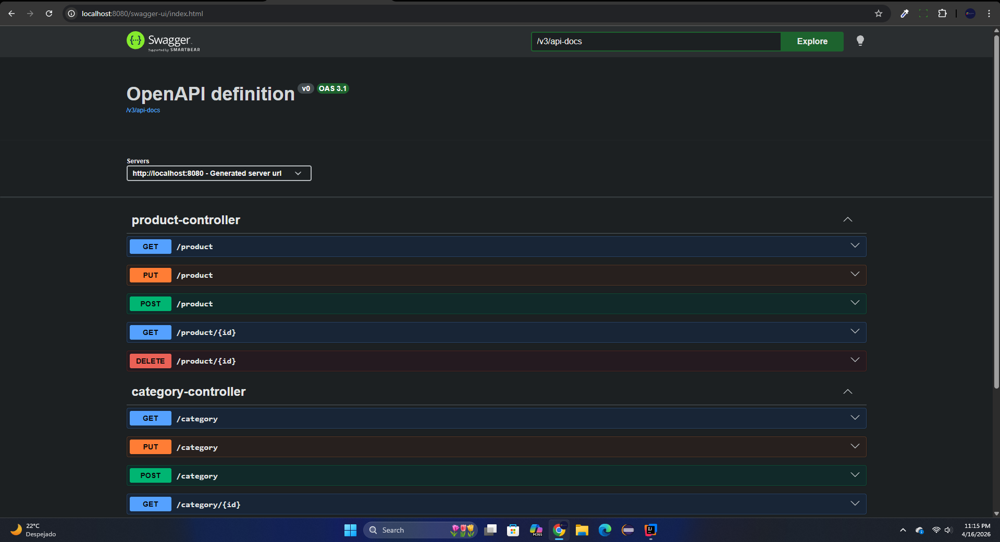

# 📦 Gestión de Inventario Simple(SGS - Ejercicio)



Este es un proyecto educativo desarrollado con **Spring Boot** para gestionar productos y categorías, implementando una arquitectura de capas (Controller-Service-Repository) y validaciones de datos robustas.

## 🚀 Tecnologías Utilizadas
* **Java 17** (o la versión que estés usando)
* **Spring Boot 3.x**
* **Spring Data JPA** - Persistencia de datos.
* **Hibernate Validator** - Validaciones de Jakarta.
* **H2 Database** - Base de datos.
* **Lombok** - Reducción de código repetitivo (Boilerplate).

## 🏗️ Arquitectura del Proyecto
El proyecto sigue el patrón de diseño N-Tier:
1.  **Entities**: Definición de las tablas `products` y `categories` con sus respectivas restricciones.
2.  **Repositories**: Interfaces que extienden de `JpaRepository` para operaciones CRUD.
3.  **Services**: Capa de lógica de negocio, manejo de excepciones y validaciones personalizadas.
4.  **Controllers**: Endpoints REST para la interacción con el cliente.
5.  **Global Exception Handler**: Manejo centralizado de errores mediante `@ControllerAdvice`.


## 🛠️ Endpoints Principales

### Categorías (`/category`)
| Método | Endpoint | Descripción |
| :--- | :--- | :--- |
| GET | `/category` | Lista todas las categorías. |
| GET | `/category/{id}` | Busca una categoría por ID. |
| POST | `/category` | Crea una nueva categoría. |
| DELETE | `/category/{id}` | Elimina una categoría. |

### Productos (`/product`)
| Método | Endpoint | Descripción |
| :--- | :--- | :--- |
| GET | `/product` | Lista todos los productos. |
| GET | `/product/{id}` | Busca un producto por ID. |
| POST | `/product` | Crea un producto (Valida que la categoría exista). |
| PUT | `/product` | Actualiza un producto existente. |


## 📦 Ejemplo de JSON para crear un Producto (POST)
```json
{
    "name": "Monitor Gamer",
    "price": 550.00,
    "stock": 10,
    "category": {
        "id": 1
    }
}
